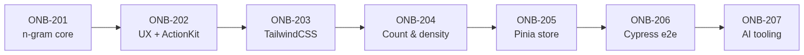
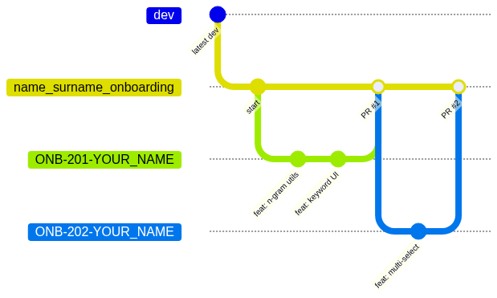
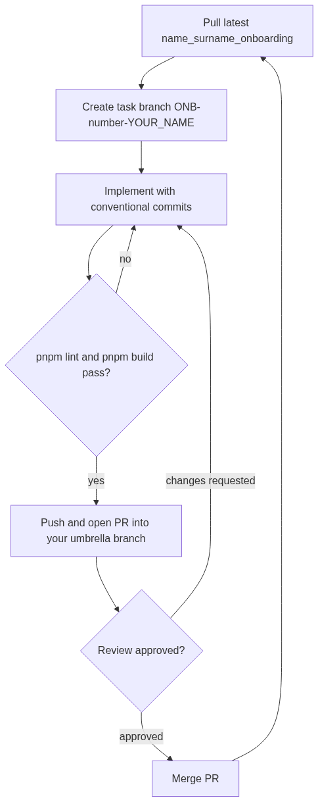

# Frontend Onboarding

**Goal:** Understand component-based Vue development, get familiar with our Code Review process, and learn how we use AI tooling in daily development.

## Task Roadmap



## Environment

- Project: https://github.com/mobileaction-juniors/demo-frontend-example
- Any IDE (we suggest WebStorm; VS Code also works well with the Claude Code extension — see ONB-207)
- Vue 3 (Composition API preferred) + Vite
- Package manager: **pnpm** (do not commit a `package-lock.json` or `yarn.lock`)
- Component library: [ActionKit](https://mobileaction.github.io/action-kit/) — used from ONB-202 onward
- Run `pnpm lint` and `pnpm build` locally before opening a PR

## Branching & Workflow

1. Create a personal umbrella branch from `dev`: `name_surname_onboarding`
2. For **each task**, create a branch from your umbrella branch: `ONB-<number>-YOUR_NAME`
3. Open a PR from the task branch **into your umbrella branch** (not into `dev`)
4. Before starting any new task, pull the latest changes from your umbrella branch
5. Follow the Development Process, Code Review Guideline, and Conventional Commit Messages documents. Every commit message must follow the conventional format (e.g. `feat(keyword-generator): add n-gram generation`)
6. Do not start the next task before the previous task's PR is opened

**Branch model** (shown for the first two tasks — the same pattern repeats for ONB-203…205):



**Per-task loop** — every ONB task goes through this cycle:



---

## ONB-201: Keyword Generator — core n-gram generation

Provide an interface for generating keywords from a given text. Work in the existing
`src/pages/keyword-generator/KeywordGenerator.vue` file.

**Steps:**

1. Create branch `ONB-201-YOUR_NAME` from your umbrella branch
2. Add a text input where the user pastes a text (e.g. an App Store description such as Facebook's)
3. Implement input cleaning as a separate utility function (lowercase, strip punctuation/extra whitespace)
4. Implement n-gram generation as a separate, testable utility function:
   - A keyword is a single word in the input
   - An n-gram keyword is n consecutive keywords
   - Generate 1-gram, 2-gram, and 3-gram keywords
   - Remove duplicates
5. Display the generated keywords grouped by n (styling is not graded — keep it simple)

**Example** — "Quick brown fox jump over fox" produces:

- 1-gram: quick, brown, fox, jump, over
- 2-gram: quick brown, brown fox, fox jump, jump over, over fox
- 3-gram: quick brown fox, brown fox jump, fox jump over, jump over fox

**Definition of done:**

- [ ] Cleaning and n-gram logic live in utility functions, not inline in the component
- [ ] No duplicate keywords in the output
- [ ] Commits follow conventional commit format
- [ ] PR opened to your umbrella branch before starting ONB-202

---

## ONB-202: Keyword Generator — UX improvements

**Steps:**

1. Create branch `ONB-202-YOUR_NAME` (after pulling your umbrella branch)
2. Add a multi-select that controls which n-grams are shown
3. Extend n-gram support from 1 up to 10
4. Add stop-word removal — filter out unwanted words such as *is, a, an, the* (keep the stop-word list in its own file so it's easy to extend)
5. Replace the plain input with an [ActionKit](https://mobileaction.github.io/action-kit/) text area
6. Render generated keywords as **ActionKit tags**

**Definition of done:**

- [ ] Only the selected n-grams are rendered
- [ ] Stop words never appear in generated keywords
- [ ] Input and output use ActionKit components
- [ ] PR opened, review comments addressed

---

## ONB-203: CSS improvement with TailwindCSS

**Steps:**

1. Create branch `ONB-203-YOUR_NAME`
2. Configure `browserslist` to support only browsers from the last 2 years
3. Add **tailwindcss** to the project
4. Remove all possible custom CSS and replace it with Tailwind utility classes
5. Install the [action-kit](https://mobileaction.github.io/action-kit/) component library (if not already added in ONB-202)
6. Add an ActionKit button that converts the user text to keywords **on demand** (generation runs on click, not on every keystroke)
7. Add an icon to the button

**Target layout after ONB-202 + ONB-203:**

```
┌────────────────────────────────────────────────────────┐
│  Keyword Generator                                     │
│                                                        │
│  ┌──────────────────────────────────────────────────┐  │
│  │ Paste an app description...                      │  │
│  │                                                  │  │
│  │ (ActionKit text area)                            │  │
│  └──────────────────────────────────────────────────┘  │
│                                                        │
│  N-grams to show:  [ 1 x ] [ 2 x ] [ 3 x ]        v    │
│                                     (multi-select)     │
│                                                        │
│  [ (icon) Generate keywords ]   (ActionKit button)     │
│                                                        │
│  1-gram   (quick) (brown) (fox) (jump) (over)          │
│  2-gram   (quick brown) (brown fox) (fox jump) ...     │
│  3-gram   (quick brown fox) (brown fox jump) ...       │
│                           (keywords as ActionKit tags) │
└────────────────────────────────────────────────────────┘
```

**Definition of done:**

- [ ] No custom CSS remains where a Tailwind utility class could be used
- [ ] Keyword generation is triggered by the button
- [ ] Merge only after your PR passes the review process

---

## ONB-204: Keyword count & density component

**Steps:**

1. Create branch `ONB-204-YOUR_NAME`
2. Implement a new page as a **component** that receives a static `text` prop from its parent page for the first load
3. Add a text area (ActionKit) for user input
4. On submission, count each keyword's occurrences in the text and its overall percentage (density)
5. Show the results in an [AG Grid](https://www.ag-grid.com/vue-data-grid/) table — install `ag-grid-vue3` (Community edition), define keyword / count / density columns, and enable column sorting
6. Use **ActionKit for all components** (the table itself is AG Grid) and **tailwindcss only** for styling
7. Make the page mobile friendly using Tailwind responsive utilities:
   - On small screens the table stacks **below** the text area
   - Neither the input nor the table may exceed the screen width
   - Reference: Responsive Design with TailwindCSS

**Target layout — desktop (side by side, table = AG Grid):**

```
┌──────────────────────────────────────────────────────────┐
│  Keyword Count & Density                                 │
│                                                          │
│  ┌─────────────────────────┐   ┌──────────────────────┐  │
│  │ Text area (ActionKit)   │   │ Keyword │ Count │ %  │  │
│  │ prefilled from `text`   │   ├─────────┼───────┼────┤  │
│  │ prop on first load      │   │ fox     │   2   │ 33 │  │
│  │                         │   │ quick   │   1   │ 17 │  │
│  │                         │   │ brown   │   1   │ 17 │  │
│  └─────────────────────────┘   │ ...     │  ...  │ .. │  │
│        [ Submit ]              └──────────────────────┘  │
└──────────────────────────────────────────────────────────┘
```

**Target layout — mobile (stacked, nothing exceeds screen width):**

```
┌────────────────────────┐
│  Keyword Count &       │
│  Density               │
│                        │
│  ┌──────────────────┐  │
│  │ Text area        │  │
│  │ (ActionKit)      │  │
│  └──────────────────┘  │
│      [ Submit ]        │
│                        │
│  ┌──────────────────┐  │
│  │ Keyword│Count│ % │  │
│  ├────────┼─────┼───┤  │
│  │ fox    │  2  │33 │  │
│  │ quick  │  1  │17 │  │
│  │ brown  │  1  │17 │  │
│  └──────────────────┘  │
└────────────────────────┘
```

**Definition of done:**

- [ ] Component receives initial text via props (no hardcoded text inside the component)
- [ ] AG Grid table shows keyword, count, and density percentage, sortable by column
- [ ] Layout verified on both desktop and mobile viewport widths
- [ ] PR opened, merged after review

---

## ONB-205: State management with Pinia

Move shared state out of the components into a central store.

**Steps:**

1. Create branch `ONB-205-YOUR_NAME`
2. Add **Pinia** to the project and register it in `main.js`
3. Create a keyword store under `src/stores/` and move the component-local state there (input text, selected n-grams, generated keywords)
4. Keep the store well structured: state, getters for derived data (e.g. keywords filtered by the selected n-grams), and actions for generation
5. Make both pages (keyword generator and count & density) read from the store where state is shared

**Definition of done:**

- [ ] Pinia store is the single source of truth — no duplicated keyword state left in components
- [ ] Store separates state, getters, and actions cleanly
- [ ] Pages behave exactly as before — this is a pure refactor, no feature changes
- [ ] PR opened, review comments addressed

---

## ONB-206: E2E testing with Cypress

Cover the main user flows with end-to-end tests.

**Steps:**

1. Create branch `ONB-206-YOUR_NAME`
2. Add **Cypress** and configure it for e2e testing
3. Add `test:e2e` (headless) and `test:e2e:open` (interactive) scripts to `package.json`
4. Write e2e tests covering the main flows:
   - Entering text and generating keywords on button click
   - Filtering by n-gram multi-select
   - Stop-word removal
   - Keyword count & density table on submission

**Definition of done:**

- [ ] `pnpm test:e2e` runs Cypress headless and all tests pass
- [ ] Every flow listed above has at least one e2e test
- [ ] PR opened, review comments addressed

---

## ONB-207: AI-assisted development — agents & configuration

Learn how we use AI coding tools (Claude Code and similar agents) responsibly in our workflow.

**Steps:**

1. Create branch `ONB-207-YOUR_NAME`
2. Install an AI coding agent (we use **Claude Code** — CLI, desktop app, or the VS Code/JetBrains extension). Interns do not have a Mobile Action e-mail— please use your personal mail.
3. Configure the agent for this repository:
   - Run `/init` (or write by hand) a `CLAUDE.md` at the repo root describing the stack (Vue 3, Vite, pnpm), commands (`pnpm dev`, `pnpm build`, `pnpm lint`), branch/PR conventions, and the conventional-commit rule
   - Review `.claude/settings.json` permissions with your buddy/mentor — allow safe read/lint commands, keep destructive commands behind prompts
   - Optional: explore custom subagents (`.claude/agents/`) and skills/slash commands to automate repeated team tasks (e.g. a code-review or commit-message skill)
4. Use the agent for at least one real change on this branch (e.g. refactor a utility from ONB-201, or generate a Cypress test from ONB-206) and note in the PR description what was AI-generated
5. Read and follow our AI usage rules:
   - **You own every line.** Review and understand AI-generated code before committing — the review process treats it exactly like hand-written code
   - Never paste secrets, tokens, or private credentials into any AI tool
   - Use AI for reviews as a first pass (e.g. `/review` on your PR), but human review is still mandatory
   - Commit messages generated by AI must still follow the conventional commit format

**Definition of done:**

- [ ] `CLAUDE.md` committed and reviewed
- [ ] At least one AI-assisted change merged through the normal PR process, disclosed in the PR description
- [ ] You can explain to your buddy/mentor what the agent did and why the code is correct
